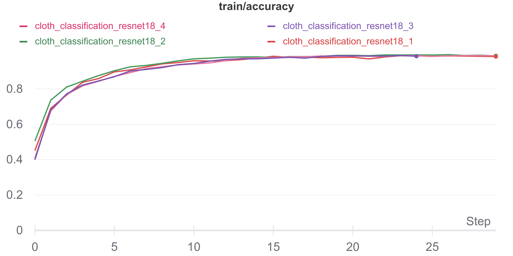
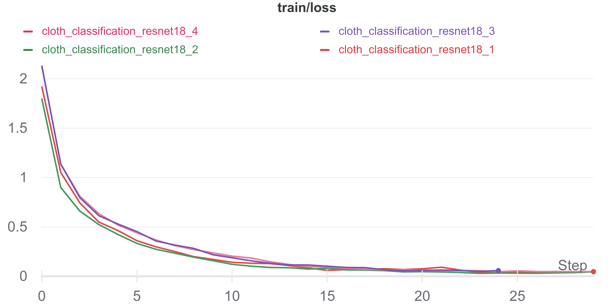
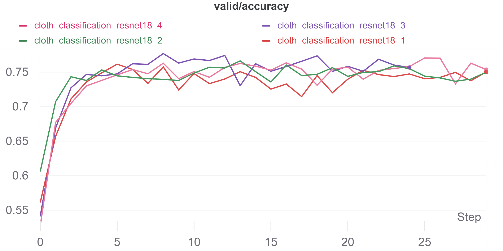
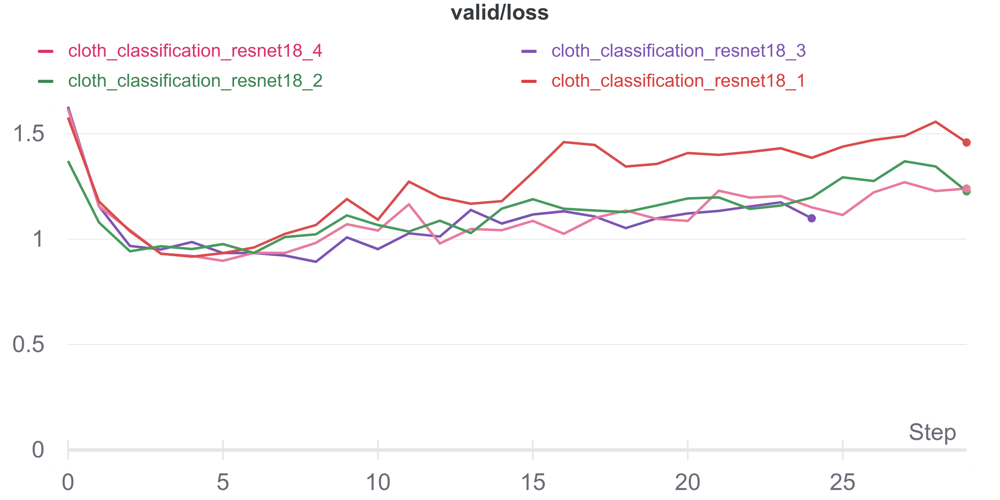
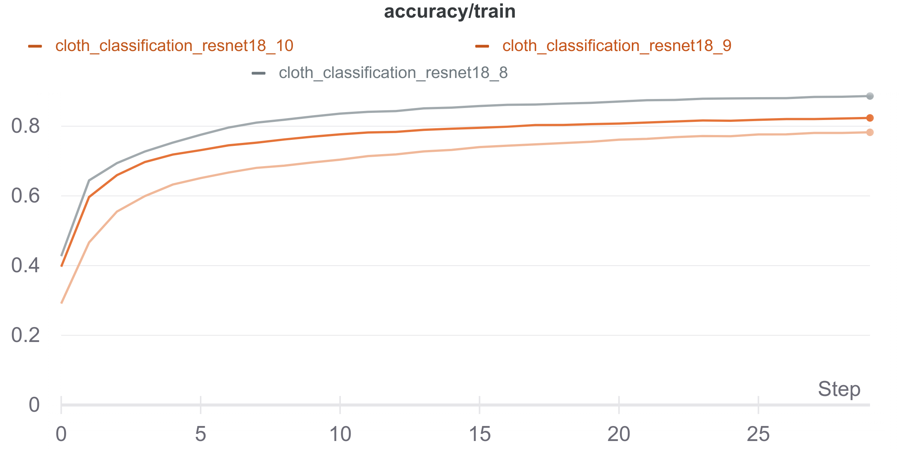
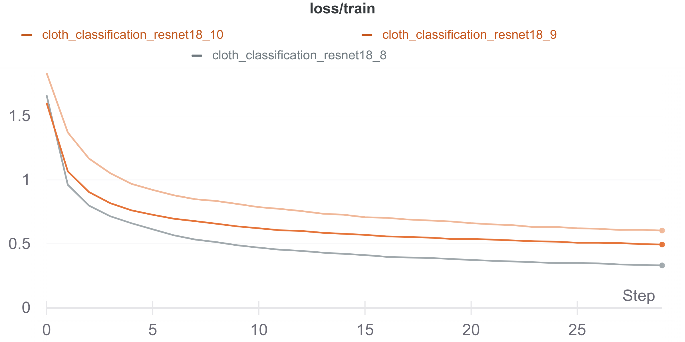
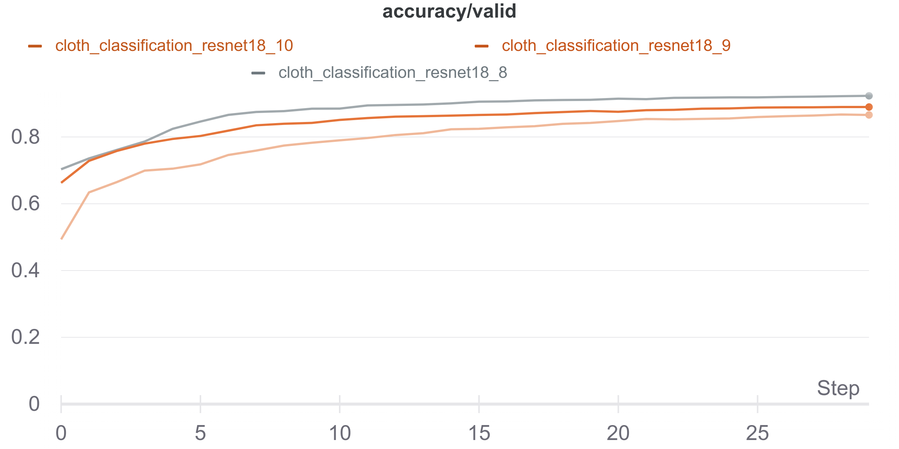
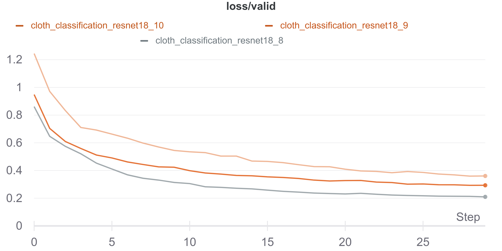

# Clothes Classification

This repo is for classification and experimental tracking for two datasets. The problem is classifying clothing images.

# Datasets Used
- [Clothing Dataset](https://github.com/alexeygrigorev/clothing-dataset)
- [Fashion Mnist Dataset](https://github.com/zalandoresearch/fashion-mnist)
# Files

- Dataloader.py
- Model.py
- Metric.py
- Callbacks.py
- Augmentation.py
- Train.py

##  Datasets
- Clothing Dataset consists of 20 classes with overall 5000 images (so the dataset considered small to the ratio of the number of classes), also the classes have huge unbiasness (ex. Skip class have 7 images)
- Fashion Mnist consists of 10 classes with 6k images for each class.

## Models
The **ClothClassifier** is trained on the Clothing dataset with resnet18 as a backbone (pretrained) and following with fully connected layers for classification 
The **FashionMnistClassifier** is trained on the Fashion Mnist Dataset, which is a customer model consistes of 6 conv blocks and 2 fully connected layers 

## Cloth dataset steps

 1. check for corrupted images using verify_corrupted_image.py
 2. implement a stratisfied data splitter to make sure the same ratios in train-valid
 3. implement model using resnet18 as a backbone 
 4. implemented a cross-validation data splitter (KFold) to evaluate the model (for time restriction, used 1 fold). Dropped the skip class which contained 7 images and dropped the accuracy by 2-3 percentile
 5. implemented ClothDataset to read and fetch images and labels
 6.  Implement image transformation pipeline using albumenations.
	 - For Train pipeline : 
		 - [X] Choice between RandomShiftScaleRotate or RandomRotate or RandomScale
		 - [X] RandomHorizontalFlip
		 - [X] RandomGaussianNoise
		 - [X] Choice between RandomBlur or RandomGaussianBlur or RandomMedianBlur
		 - [X] Choice between RandomBrightnessContrast or RandomColorJitter 
		 - [ ] Upsampling-Downsampling
		 - [X] Trained an experiement with no augmentation 
		 - [X] resizing image to (224,224) dimensions
		 - [X] normalization with (mean=(0.485, 0.456, 0.406), std=(0.229, 0.224, 0.225))
		 - [X] image to Tensor datatype
	 -  For Train pipeline : 
		 - [X] resizing image to (224,224) dimensions
		 - [X] normalization with (mean=(0.485, 0.456, 0.406), std=(0.229, 0.224, 0.225))
		 - [X] image to Tensor datatype
7.  Learning Rate used :
	- [X] 1e-3
	- [X] 1e-4
	- [X] 1e-2
	- [X] Schedular StepLR (every 10 steps lr drop by 0.1 percentage)
8. Image Size:
	- [X] Image shape : 224,224
	- [ ] Image shape : 512,512
9. Batch Sizes:
	- 32
	- 64
10. Train split:
	- [X] 0.7
	- [ ] 0.8 
11. Loss function : CrossEntropyLoss
12. Metric : Accuracy , Precision, Recall, F1-Score
13. Optimizer : Adam
14. Callbacks: CheckpointCallback

|       |Accuracy                                                       |Loss                                                              |
|-------|---------------------------------------------------------------|------------------------------------------------------------------|
|Train  |||
|Valid  |||

## Fashion mnist dataset steps

 1. prepare csv file with images label and 784 column for pixels using prepare_fashion_csv.py
 2. implemented FashionMnistDataset to read and fetch images and labels
 3.  Implement image transformation pipeline using albumenations.
	 - For Train pipeline : 
		 - [X] Choice between RandomShiftScaleRotate or RandomRotate or RandomScale
		 - [X] RandomHorizontalFlip
		 - [X] RandomGaussianNoise
		 - [X] Choice between RandomBlur or RandomGaussianBlur or RandomMedianBlur
		 - [X] Choice between RandomBrightnessContrast or RandomColorJitter 
		 - [ ] Upsampling-Downsampling
		 - [X] Trained an experiement with no augmentation 
		 - [X] resizing image to (28,28) dimensions
		 - [X] normalization with (mean=(0.485, 0.456, 0.406), std=(0.229, 0.224, 0.225))
		 - [X] image to Tensor datatype
	 -  For Train pipeline : 
		 - [X] resizing image to (224,224) dimensions
		 - [X] normalization with (mean=(0.485, 0.456, 0.406), std=(0.229, 0.224, 0.225))
		 - [X] image to Tensor datatype
4.  Learning Rate used :
	- [X] 1e-3
	- [X] 1e-4
	- [X] 1e-2
	- [X] Schedular StepLR (every 10 steps lr drop by 0.1 percentage)
5. Image Size:
	- [X] Image shape : 28,28
6. Batch Sizes:
	- 32
	- 64
7. Train split:
	- [X] 0.7
	- [ ] 0.8 
8. Loss function : CrossEntropyLoss
9. Metric : Accuracy , Precision, Recall, F1-Score
10. Optimizer : Adam
11. Callbacks: CheckpointCallback

|       |Accuracy                                                      |Loss                                                            |
|-------|--------------------------------------------------------------|----------------------------------------------------------------|
|Train  |||
|Valid  |||

## Benchmark

SmartyPants converts ASCII punctuation characters into "smart" typographic punctuation HTML entities. For example:

|                     |Params(M) |Flops(G)|Macs(G) |
|---------------------|----------|--------|--------|
|ClothClassifier      |11.7      |3.6     |1.8     |
|FashionMnistClassifer|0.14      |0.044   |0.022   |

